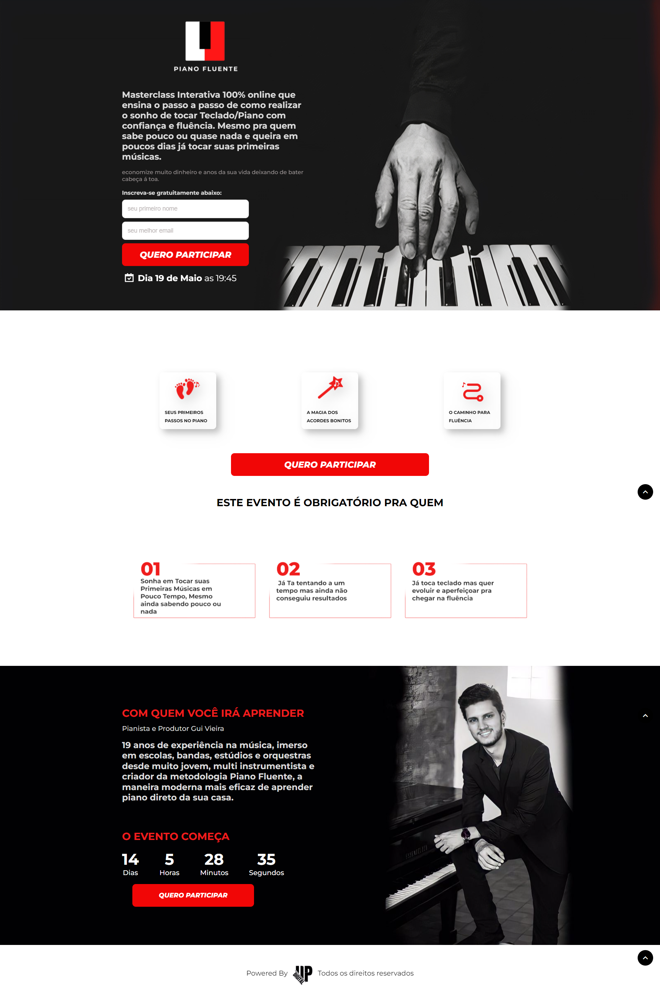
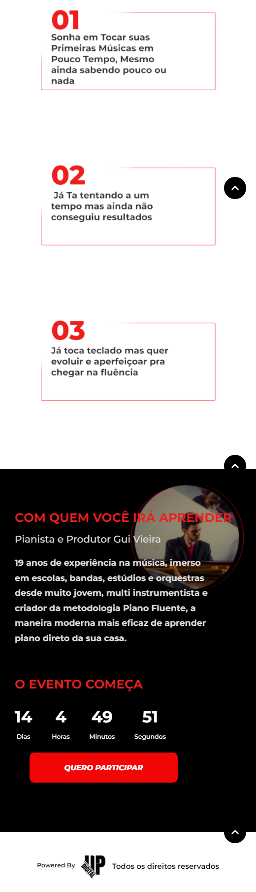

## Piano-Fluente-Responsivo

[Demo JBL](https://jblresponsivo.netlify.app/)

  
  
  

### Resumo

Landing Page básica captura de leads criada para suprir a necessidade de um cliente, feita através de Html, Css e Javascript.

### Motivação

Me desenvolver com desafios vislumbrados por terceiros aplicando as tecnologias brevemente estudadas.

### Construído com

- Html5
- CSS3
- JavaScript/ScrollReveal

### Recursos

**1. Design Responsivo.**

**2. ScrollReveal.**

**3. ScrollUp.**
